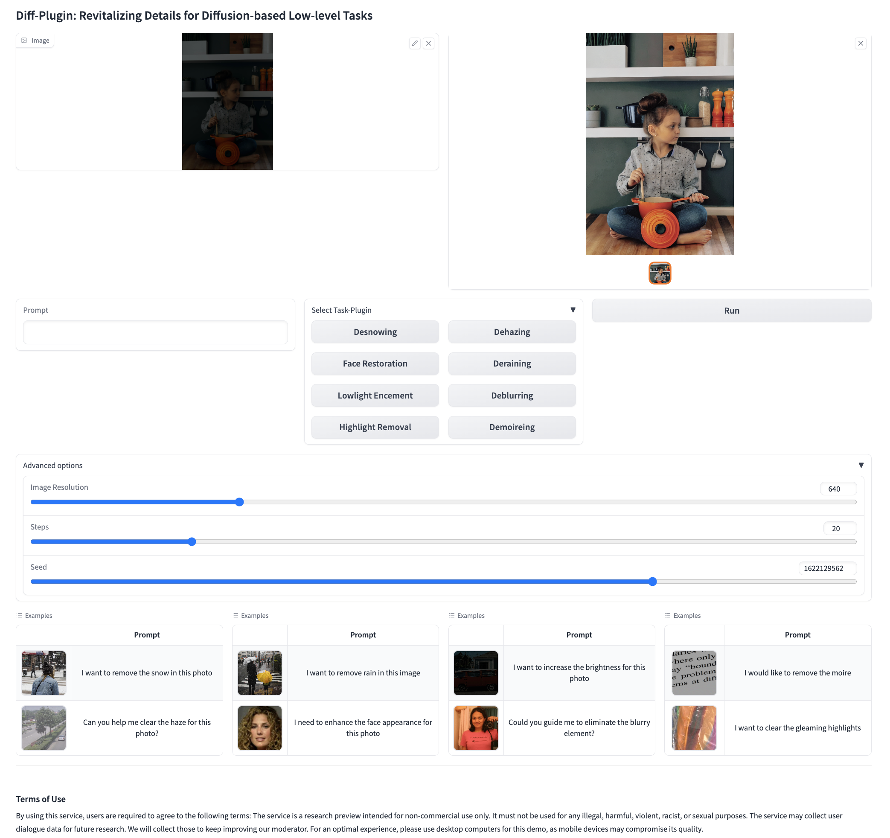

<br />
<p align="center">
  <h1 align="center"><a href="https://yuhaoliu7456.github.io/Diff-Plugin/" target="_blank"> Diff-Plugin: Revitalizing Details for Diffusion-based Low-level tasks</a></h1>
  <p align="center">
    <!-- CVPR, 2024     -->
    <a href='https://arxiv.org/abs/2403.00644' target="_blank">
      
    </a> &nbsp;&nbsp;&nbsp;
    <a href='https://youtu.be/VMQYt5rToZU' target="_blank">
      
    </a>&nbsp;&nbsp;&nbsp;
    <br>
    <a href="https://yuhaoliu7456.github.io"><strong>Yuhao Liu</strong></a> 
    ·
    <a href="https://zhke.io"><strong>Zhanghan Ke</strong><sup>十</sup></a>
    .
    <a href="https://scholar.google.com/citations?user=cBFup5QAAAAJ&hl=en"><strong>Fang Liu</strong><sup>十</sup></a>
    .
    <a href="http://nxzhao.com"><strong>Nanxuan Zhao</strong></a>
    ·
    <a href="https://www.cs.cityu.edu.hk/~rynson/"><strong>Rynson W.H. Lau</strong><sup>十</sup></a>
  </p>

<br />

Code repository for our paper "<a href="">Diff-Plugin: Revitalizing Details for Diffusion-based Low-level tasks</a>" in <b>CVPR 2024</b>.

<br />

Diff-Plugin introduces a novel framework that empowers a single pre-trained diffusion model to produce high-fidelity results across a variety of low-level tasks. It achieves this through lightweight plugins, without compromising the generative capabilities of the original pre-trained model. Its plugin selector also allows users to perform low-level visual tasks (either single or multiple) by selecting the appropriate task plugin via language instructions.

<!-- #insert a figure -->


## News !!

- Test and Train Codes and Models are released!! 

## To-Do List

<!-- - [ ] Gradio demo for easy interaction. -->
<!-- - [ ] Implement evaluation metrics for assessment. -->
- [ ] Provide training scripts for the plugin selector.

## Environment Setup

To set up your environment, follow these steps:

```bash
conda create --name DiffPlugin python=3.8
conda activate DiffPlugin
conda install --file requirements.txt
```


# Inference 
Run the following command to apply task plugins. Results are saved in the `temp_results` folder.


```
bash infer.sh
```
Currently, we provide **eight** task plugins: `derain`, `desnow`, `dehaze`, `demoire`, `deblur`, `highlight` removal, `lowlight` enhancement and blind `face` restoration. 

Before beginning testing, please specify your desired task on the first line.

# Gradio Demo
Single GPU with 24G memory is generally enough for an image with resolution of 1024*720. 
```bash 
python demo.py 
```




#### Note that in the advanced options, you can adjust
- the image resolution in the format of `width==height` for flexible outputs; 
- the diffusion steps for faster speed (by default is 20);
- the random seed to generate different results.


# Train your own task-plugin

### Step-1: construct your own dataset
1. Navigate to your training data directory:
```
cd data/train
touch task_name.csv
```
Arrange your data according to the format in `example.csv`, using **relative paths** for the samples specified in the train.sh script.

Note that we leave the data root for filling in the **train.sh** file and only support the relative path for the used samples.

Example for a sample named `a1`:

- Input: `/user/Dataset/task1/input/a1.jpg`
- GT: `/user/Dataset/task1/GT/a1.jpg`

Your `task_name.csv` should contain lines in the following format:
```
task1/input/a1.jpg,task1/GT/a1.jpg
```

## Step-2: start training
Replace `task` name with your task, and execute the training script with:
```
bash train.sh
```
Note that:

- For single GPU training, use `python xxx`; for multiple GPUs, use `accelerate xxx`.
- Ensure the task name matches the folder name in `data/train`
- Training was conducted on four A100 GPUs with a batch size of 64


# Evaluation
Please refer to the README.md under the `metric` fodler

## License
This project is released under the [Creative Commons Attribution NonCommercial ShareAlike 4.0](https://creativecommons.org/licenses/by-nc-sa/4.0/legalcode) license.


## Citation

If you find Diff-Plugin useful in your research, please consider citing us:

```bibtex
@inproceedings{liu2024diff,
  title={Diff-Plugin: Revitalizing Details for Diffusion-based Low-level Tasks},
  author={Liu, Yuhao and Ke, Zhanghan  and Liu, Fang and Zhao, Nanxuan and Rynson W.H. Lau},
  booktitle={CVPR},
  year={2024}
}
```

## Acknowledgements
Special thanks to the following repositories for supporting our research:
- [Diffusers](https://github.com/huggingface/diffusers)
- [CLIP](https://github.com/openai/CLIP)
- [ControlNet](https://github.com/lllyasviel/ControlNet)


## Contact
This repository is maintained by Yuhao Liu ([@Yuhao](https://github.com/yuhaoliu7456)).  
For questions, please contact `yuhaoliu7456@outlook.com`.


